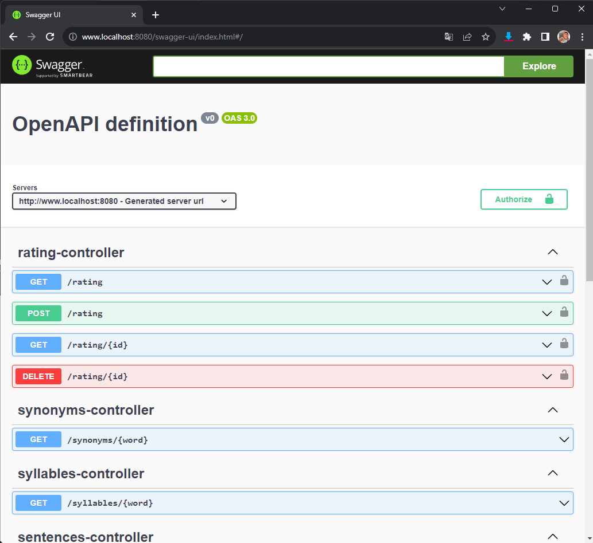

# Dicionário_api<h1 align="center">Dicionário API</h1>

<p align="center">
   <a href="https://opensource.org/licenses/Apache-2.0"></a>
  <br>
  <a href="https://wa.me/+5532998002817"></a>
  <a href="https://www.linkedin.com/in/leonardotissi/"></a>
  <a href="mailto:leonardo.tissi.si@gmail.com"></a>
</p>

<p align="center">  

⭐ Esse é um projeto para demonstrar meu conhecimento técnico no desenvolvimento Web com spring boot utilizando a linguagem Kotlin.

Desenvolver a API foi uma jornada empolgante e desafiadora que me permitiu explorar diversas tecnologias e aprimorar minhas habilidades como desenvolvedor. Utilizei o Spring Boot em conjunto com a linguagem Kotlin para criar uma base sólida para o projeto.

A API faz uso extensivo dos recursos oferecidos pelo Spring, incluindo o Spring Mail para comunicação por e-mail, validação de dados com Spring Validation, e o Spring Security para garantir a segurança da aplicação. A autenticação é feita com JSON Web Tokens (JWT) utilizando a biblioteca Spring Security e a autenticação do tipo Bearer Token é utilizada para as requisições administrativas.

Um dos aspectos mais interessantes da API é sua capacidade de se comunicar com o site dicio.com.br, através da biblioteca Jsoup, para buscar significados de palavras, exemplos em frases, separação silábica e sinônimos. Isso enriquece significativamente a funcionalidade da aplicação.

A gestão dos dados é realizada através do MySQL, com migrações gerenciadas pelo Flyway. Isso garante a consistência e a manutenção adequada do banco de dados ao longo do tempo.

A API também oferece um completo conjunto de operações CRUD para gerenciar um sistema de avaliações. Além disso, um relatório foi criado com a ajuda do Thymeleaf para apresentar informações de forma clara e acessível.

Para a documentação, utilizei a biblioteca Swagger, tornando mais fácil para outros desenvolvedores entenderem e utilizarem a API. Além disso, implementei diversos testes, incluindo testes unitários e de integração. Os testes são feitos em um ambiente separado usando containers, o que garante um ambiente de teste isolado e confiável. As bibliotecas MockK, AssertJ e Testcontainers foram utilizadas para facilitar a criação e execução dos testes.

Para o armazenamento em cache de algumas requisições, escolhi a biblioteca Redis, que oferece um desempenho excepcional e escalabilidade.

A experiência de trabalhar com Docker foi incrivelmente valiosa. Utilizei o Docker para criar uma imagem da API e o Docker Compose para gerenciar os containers necessários para a execução da aplicação. A imagem Docker está disponível no Docker Hub, tornando o processo de implantação mais fácil e acessível.

A motivação por trás do desenvolvimento desta API foi a necessidade de substituir uma API anterior que não estava mais funcionando em um aplicativo Android anterior. Isso despertou meu interesse em criar uma solução personalizada que fosse confiável e atendesse às necessidades específicas do meu projeto.

Para manter a qualidade do código e a integridade da aplicação, implementei a integração contínua usando o GitHub Actions. Sempre que faço um push no repositório, os testes são executados automaticamente para verificar a integração da API.

Embora tenham ocorrido desafios e imprevistos durante o desenvolvimento, a perseverança e o aprendizado constante me ajudaram a superá-los. No final, estou orgulhoso do resultado alcançado e empolgado para continuar aprimorando essa API e explorando novos desafios no mundo do desenvolvimento de software.

</p>

</br>

<p float="left" align="center">





</p>

Clique  <a href="/app/release/app-release.apk?raw=true">aqui</a> para acessar a imagem da aplicação no Docker Hub.

## Tecnologias usadas e bibliotecas de código aberto

- [Linguagem Kotlin](https://kotlinlang.org/)

- Spring Boot
  - Spring Validation: Validação de requisições;
  - Spring Security: Segurança da api;
  - Spring mail: Envio de email;
  - Spring JPA: Integração de aplicações Spring com a JPA;
  - Spring Starter Web: Auxiliar na construção de aplicações web;
  - Spring JDBC juntamente com o MySQL connector: Para conexão com banco de dados;
  - Spring DevTools: conjunto de funcionalidades que ajudam durante o desenvolvimento;
  - Spring Security Test: Segurança nos testes;
  
- Testes
  - MockK
  - AssertJ
  - TestContainers: Testes em containers Docker;

- Segurança
  - Json Web Token (JWT) : Segurança com a utilização de token;

- Documentação
  - Swagger: Documentação da API;

- Persistencia de dados
  - MySQL - Banco de dados;
  - Flyway: Sistema de migrations e versionamento do banco de dados;
  - Redis: Cache para as requisições;

- Relatórios
  - Thymeleaf - Para gerar relatórios
 
- Arquitetura
  - MVC (View - View - Controller)

- Bibliotecas
  - [JWT](https://jwt.io/)
  - [TestContainers](https://testcontainers.com/)
  - [Thymeleaf](https://www.thymeleaf.org/)
  - [Redis](https://redis.io/)
  - [MockK](https://mockk.io/)
  - [AssertJ](https://assertj.github.io/doc/)
  - [Jsoup](https://jsoup.org/)


## Arquitetura

**Student Diary** utiliza a arquitetura MVC e o padrão de Repositories
</br></br>

<div align="center" style=" width: 100%; background-color: white; ">

</div>
<br>


## Features
### Spring Boot
### Web development
### API REST
### Kotlin

<br>

# Licença

```xml
Copyright [2023] [Leonardo Tissi]

Licensed under the Apache License, Version 2.0 (the "License");
you may not use this file except in compliance with the License.
You may obtain a copy of the License at

  http://www.apache.org/licenses/LICENSE-2.0

Unless required by applicable law or agreed to in writing, software
distributed under the License is distributed on an "AS IS" BASIS,
WITHOUT WARRANTIES OR CONDITIONS OF ANY KIND, either express or implied.
See the License for the specific language governing permissions and
limitations under the License.
```
